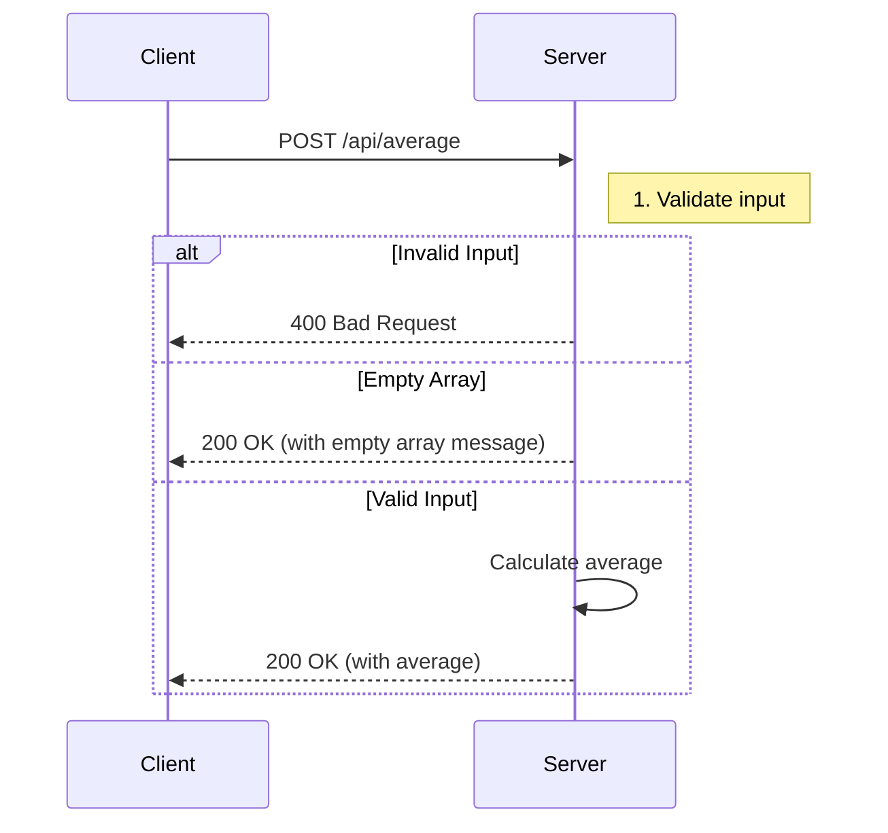

# Ratings Average Microservice

A microservice that calculates the average of numeric ratings. This service provides a simple REST API endpoint that accepts an array of numbers and returns their arithmetic mean.

## API Documentation

### Base URL
```
https://cs-361-project-three.vercel.app/api
```

### Requesting Data

To request the average of an array of numbers, make a POST request to the `/average` endpoint with a JSON body containing an array of numbers under the `ratings` key.

#### Example Request

```javascript
// JavaScript/TypeScript
const response = await fetch('https://cs-361-project-three.vercel.app/api/average', {
  method: 'POST',
  headers: {
    'Content-Type': 'application/json',
  },
  body: JSON.stringify({
    ratings: [4, 5, 3, 5]  // Array of numbers to average
  })
});

const data = await response.json();
console.log(data);
```

#### Python Example

```python
import requests

response = requests.post(
    'https://cs-361-project-three.vercel.app/api/average',
    json={
        'ratings': [4, 5, 3, 5]  # Array of numbers to average
    }
)
data = response.json()
print(data)
```

### Receiving Data

The service will respond with a JSON object containing the calculated average or an error message.

#### Success Response (200 OK)

```json
{
  "average": 4.25
}
```

#### Error Response (400 Bad Request)

When the input is invalid (non-numeric values, wrong format, etc.):

```json
{
  "error": "All ratings must be numbers"
}
```

#### Empty Array Response (200 OK)

When an empty array is provided:

```json
{
  "error": "No ratings provided",
  "average": null
}
```

## Sequence Diagram



## Error Handling

- **400 Bad Request**: Returned when the input is not a valid array of numbers
- **500 Internal Server Error**: Returned for unexpected server errors
- **405 Method Not Allowed**: Returned for non-POST requests

## Rate Limiting

No rate limiting is currently implemented. Consider implementing rate limiting in production environments.

## Local Development

1. Clone the repository
2. Install dependencies:
   ```bash
   npm install
   ```
3. Run the development server:
   ```bash
   npm run dev
   ```
4. The API will be available at `https://cs-361-project-three.vercel.app/api/average`

## Dependencies

- Node.js 18+
- Next.js 13+
- TypeScript

## License

MIT
